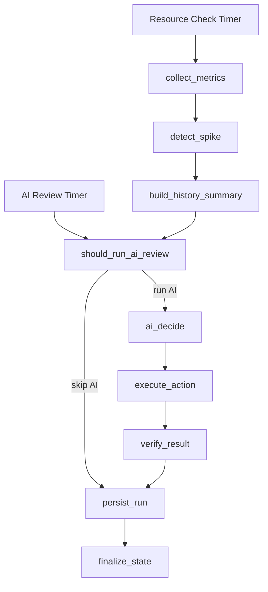

# CSS Elasticity AIOps Agent

`css-elasticity-aiops-agent` is a production-oriented elasticity controller for **Huawei Cloud CSS**. It combines Cloud Eye metrics, rule-based safety checks, optional OpenSearch diagnostics, and an OpenAI-compatible model to decide whether a CSS cluster should scale, hold, or change flavor.

This project is designed for operators and platform teams who want an **AI-assisted but policy-constrained** elasticity workflow, not a chatbot and not a generic multi-agent framework.

## Why This Project Exists

Operating CSS clusters at scale is usually a mix of threshold rules, manual reviews, and slow operational feedback loops. The goal of this project is to make that process faster and more consistent without turning scaling into uncontrolled automation.

The agent:

- collects CSS metrics through Huawei Cloud CES / Cloud Eye
- detects spikes and sustained pressure
- asks an OpenAI-compatible model for an elasticity recommendation
- validates the recommendation with local safety rules and policy constraints
- executes CSS scaling only when the configured run mode allows mutation
- verifies the result and records the full history in SQLite

In short: **AI can recommend**, but the platform policy still decides whether a mutation is allowed.

## Key Features

- Real Huawei Cloud CSS metric collection
- AI-driven elasticity review using any OpenAI-compatible API
- Support for `scale_out`, `scale_in`, `change_flavor`, and `hold`
- Cooldown windows, min/max limits, and node-type aware safety checks
- Optional shard-aware OpenSearch diagnostics for safer data-node scale decisions
- SQLite persistence for metrics, decisions, actions, and run history
- `--once` and `--loop` execution modes
- Recommendation-only, approval-required, and auto-execute operating modes
- Unit tests for core decision and validation logic

## High-Level Workflow



## Project Structure

```text
app/
  main.py                    CLI entrypoint
  graph.py                   LangGraph workflow
  scheduler.py               Single-run and loop scheduler
  ai_client.py               OpenAI-compatible AI client
  config.py                  Environment-based configuration
  metrics/                   Real and mock metrics providers
  executors/                 Real and mock CSS action executors
  diagnostics/               Optional OpenSearch diagnostics
  nodes/                     Workflow nodes
  repositories/              SQLite persistence layer
  services/                  Policy, cooldown, validation, spike analysis
tests/                       Unit tests
```

## Requirements

- Python 3.11+
- A Huawei Cloud CSS cluster
- Huawei Cloud credentials with read access to CSS / CES and permission to execute CSS scaling
- An OpenAI-compatible model endpoint
- Network access to Huawei Cloud IAM, CSS, CES, and the model provider

## Quick Start

Create a virtual environment:

```bash
python -m venv .venv
source .venv/bin/activate
```

Install dependencies:

```bash
pip install -r requirements.txt
```

Copy the sample environment file:

```bash
cp .env.example .env
```

Run tests:

```bash
python -m pytest -q
```

Run one workflow cycle:

```bash
python -m app.main --once
```

Run continuously:

```bash
python -m app.main --loop
```

## Recommended First Run

For a safe first deployment, keep the agent in recommendation-only mode:

```env
AGENT_RUN_MODE=recommend-only
CSS_MUTATION_ENABLED=false
```

This lets you validate:

- metric collection
- spike detection
- AI decision quality
- policy checks
- persistence and history

without allowing any real CSS scaling actions.

## Configuration Overview

The project is configured entirely through environment variables. Start from `.env.example`.

### AI Provider

Any OpenAI-compatible API can be used, including Huawei Cloud ModelArts MaaS when exposed through an OpenAI-compatible endpoint.

```env
OPENAI_BASE_URL=https://your-openai-compatible-endpoint/v1
OPENAI_API_KEY=<api-key>
OPENAI_MODEL=<model-name>
```

### Huawei Cloud Runtime

Set the Huawei Cloud runtime values explicitly:

```env
HUAWEICLOUD_SDK_AK=replace-me
HUAWEICLOUD_SDK_SK=replace-me
HUAWEICLOUD_REGION=replace-me
HUAWEICLOUD_PROJECT_ID=replace-me
HUAWEICLOUD_IAM_ENDPOINT=https://iam.myhuaweicloud.com
HUAWEICLOUD_CSS_ENDPOINT=
HUAWEICLOUD_CES_ENDPOINT=
CLUSTER_ID=replace-me
CLUSTER_NAME=replace-me
```

### Providers

Use real CSS/CES integrations for production-style runs:

```env
METRICS_PROVIDER=css
EXECUTOR_PROVIDER=css
```

### Mutation Safety

Automatic mutation requires two explicit signals:

```env
AGENT_RUN_MODE=auto-execute
CSS_MUTATION_ENABLED=true
```

If either one is missing, the agent stays non-mutating.

### Optional OpenSearch Diagnostics

To make scale-in decisions safer for shard-heavy clusters, enable OpenSearch diagnostics:

```env
DIAGNOSTICS_PROVIDER=opensearch
OPENSEARCH_ENDPOINT=https://replace-with-endpoint:9200
OPENSEARCH_USERNAME=replace-with-username
OPENSEARCH_PASSWORD=<password>
OPENSEARCH_VERIFY_TLS=false
```

When enabled, the agent inspects shard sizing, allocation skew, and storage balance before allowing risky data-node shrink decisions.

## Operating Modes

- `observe-only`: collect and persist signals without AI execution
- `recommend-only`: collect signals, call AI, validate the result, but never mutate CSS
- `approval-required`: require explicit approval data before mutation
- `auto-execute`: allow real CSS mutation when policy checks pass

For most users, `recommend-only` is the right starting point.

## Supported Decisions

The workflow supports:

- `hold`
- `scale_out`
- `scale_in`
- `change_flavor`

The executor is node-type aware and supports:

- `ess` for data nodes
- `ess-client` for client nodes
- `ess-master` for dedicated master nodes

## Persistence

The agent stores runtime history in SQLite, including:

- collected metrics
- AI decisions
- executed or skipped actions
- verification results
- workflow state

Default local paths:

```env
SQLITE_DB_PATH=data/agent.sqlite3
LOG_DIR=data/logs
```

These paths are intentionally excluded from Git tracking.

## Testing

Run the test suite with:

```bash
python -m pytest -q
```

The included tests cover policy logic, spike detection, persistence, state transitions, capacity analysis, and AI decision parsing behavior.

## Security Notes

- Do not commit real Huawei Cloud credentials
- Do not commit real model API keys
- Keep `.env` local only
- Start in non-mutating mode before enabling automation
- Review node limits, cooldowns, and enterprise policy settings before production use

## GitHub Reader Notes

This repository is intentionally focused on the **agent runtime itself**, not on surrounding infrastructure such as dashboards, deployment manifests, or CI pipelines. The current codebase is useful if you want to:

- study a practical LangGraph-based AIOps controller
- adapt AI-assisted scaling logic for Huawei Cloud CSS
- test safe recommendation flows before enabling real mutations
- extend the policy engine or diagnostics path for enterprise CSS clusters

## Roadmap Ideas

- container packaging
- deployment examples for ECS / CCE
- metrics dashboards and operational runbooks
- more replay and audit tools
- richer approval workflows
- more provider integrations for diagnostics and policy inputs

## License

No license file has been added yet. If you plan to open this project for wider community use, add an explicit license before external adoption.
- shard-count skew above `MAX_SHARD_SKEW_RATIO`

Recommended production posture for large clusters:

- Client node scale-out can be auto-executed when traffic is behind a load balancer and limits allow it.
- Client node scale-in should require sustained low load and safe traffic drain.
- Data node scale-out should usually be approval-gated unless the customer explicitly allows auto execution.
- Data node scale-in, master changes, and flavor changes should remain approval-required.
- Pending CSS operations block new AI actions until verification completes.

### Data Node Scale-In Guard

Data node scale-in is blocked by default because it can trigger shard relocation and affect workload latency:

```env
CSS_DATA_SCALE_IN_ALLOWED=false
```

Only enable this for controlled maintenance windows after validating shard health, disk headroom, and customer impact:

```env
CSS_DATA_SCALE_IN_ALLOWED=true
```

### Traffic Entry Mode and Client Scale-In

Client nodes do not store shards, but they may be application entry points. If applications connect directly to Client node IPs and a Client node is removed, those connections fail. Configure the traffic entry mode explicitly:

```env
CSS_TRAFFIC_ENTRY_MODE=unknown
CSS_CLIENT_SCALE_IN_ALLOWED=false
```

Supported modes:

- `unknown`: default; Client node scale-in is blocked.
- `direct_ip`: applications connect directly to node IPs; Client node scale-in is blocked.
- `load_balancer`: traffic is behind a load balancer or equivalent drain mechanism; Client node scale-in can be allowed if `CSS_CLIENT_SCALE_IN_ALLOWED=true`.

The validator requires both:

```env
CSS_TRAFFIC_ENTRY_MODE=load_balancer
CSS_CLIENT_SCALE_IN_ALLOWED=true
```

Without both, any `ess-client` scale-in decision is converted to `hold`.

### Scheduling

```env
RESOURCE_CHECK_INTERVAL_SECONDS=300
AI_CHECK_INTERVAL_SECONDS=1800
```

Resource checks run every 5 minutes by default. AI reviews run every 30 minutes by default. A spike detected during a resource check immediately triggers AI review.

For active elasticity tests or faster Client node scale-in observation, a 1-minute schedule is practical:

```env
RESOURCE_CHECK_INTERVAL_SECONDS=60
AI_CHECK_INTERVAL_SECONDS=60
FAST_SCALE_IN_REVIEW_ENABLED=true
```

`RESOURCE_CHECK_INTERVAL_SECONDS` controls metrics collection and spike detection. `AI_CHECK_INTERVAL_SECONDS` controls normal non-spike reviews, which matters for scale-in because scale-in normally follows sustained low load instead of a spike. `FAST_SCALE_IN_REVIEW_ENABLED=true` lets the workflow trigger an immediate AI review once extra Client nodes have stayed below the configured low-load window, without waiting for the normal AI review interval.

Do not make the interval shorter than the metric source can reliably refresh. A 60-second interval is usually a good lower bound for test runs; production large clusters should balance reaction speed against Cloud Eye delay, AI cost, and operational noise.

### AI-Driven Delta Sizing

The AI can return `delta > 1`. The application does not hard-code a fixed scale-out or scale-in quantity. Instead, the prompt receives recent business growth or decline, expected CSS operation duration, current topology, node limits, cooldown state, pending operation state, and recent scaling history. The AI is responsible for choosing the scale quantity.

```env
CSS_CLIENT_SCALE_OUT_MAX_DELTA=0
CSS_CLIENT_SCALE_IN_MAX_DELTA=0
CSS_DATA_SCALE_OUT_MAX_DELTA=0
CSS_DATA_SCALE_IN_MAX_DELTA=0
```

`*_MAX_DELTA=0` means no per-action cap beyond node limits and product safety rules. Set a positive max delta only as a safety guard against overly aggressive AI output. The guard caps the AI delta; it does not raise a smaller AI delta.

To allow a single action to add 5 or 10 Client nodes, configure enough node-type max headroom:

```env
CSS_NODE_LIMITS_JSON={"ess-client":{"min":3,"max":20},"ess":{"min":3,"max":64},"ess-master":{"allowed_counts":[3,5,7]}}
```

To prevent a single AI decision from adding more than 10 Client nodes:

```env
CSS_CLIENT_SCALE_OUT_MAX_DELTA=10
```

Use the same pattern for controlled multi-node scale-in caps:

```env
CSS_CLIENT_SCALE_IN_MAX_DELTA=5
```

Data-node scale-in remains conservative. Even if AI returns `delta > 1`, the validator and executor still clamp data-node shrink to avoid removing half or more of the current data nodes in one operation, and the policy layer can block data-node scale-in when OpenSearch capacity diagnostics indicate shard, disk, or skew risk.

Recommended fast Client scale-in test posture:

```env
RESOURCE_CHECK_INTERVAL_SECONDS=60
AI_CHECK_INTERVAL_SECONDS=60
SCALE_IN_LOW_LOAD_MINUTES=10
CSS_TRAFFIC_ENTRY_MODE=load_balancer
CSS_CLIENT_SCALE_IN_ALLOWED=true
CSS_CLIENT_SCALE_IN_MAX_DELTA=2
CSS_CLIENT_SCALE_IN_COOLDOWN_MINUTES=10
```

Use a longer `SCALE_IN_LOW_LOAD_MINUTES` in production. For large clusters, 30-120 minutes is safer unless traffic is predictable and drain automation is proven.

### Spike Thresholds

```env
CPU_SPIKE_THRESHOLD=80
LATENCY_SPIKE_THRESHOLD=500
REJECTED_SPIKE_THRESHOLD=1
QPS_SPIKE_THRESHOLD=2.0
```

`QPS_SPIKE_THRESHOLD` is a multiplier against the previous snapshot. For example, `2.0` means QPS doubled.

### Verification

CSS scaling is asynchronous. After submitting a scale action, the executor polls CSS until the target node count is reached and target nodes are stable.

```env
CSS_VERIFY_TIMEOUT_SECONDS=900
CSS_VERIFY_POLL_INTERVAL_SECONDS=30
CSS_BLOCKING_VERIFICATION=false
```

The default workflow behavior is non-blocking. A scale action is submitted, one immediate verification probe is recorded, and if CSS is still provisioning, the operation is persisted as pending. Later scheduler cycles continue collecting metrics and checking the pending operation. AI reviews are skipped while a pending scaling operation exists, preventing duplicate scale-out or scale-in requests during the long CSS provisioning window.

Use `CSS_BLOCKING_VERIFICATION=true` only for manual validation scripts where you explicitly want the process to wait until CSS reaches the target state or the timeout expires.

## Safe Smoke Test

Before allowing real scaling, run a safe smoke test with CSS writes disabled:

```bash
AGENT_RUN_MODE=recommend-only CSS_MUTATION_ENABLED=false python -m app.main --once
```

This validates:

- CSS cluster access
- Cloud Eye metric collection
- Model API access
- AI response parsing
- persistence
- action validation
- mutation guard behavior

## Run One Cycle

Run one workflow cycle:

```bash
python -m app.main --once
```

This performs:

1. Read current CSS node count.
2. Collect Cloud Eye metrics.
3. Detect spikes.
4. Build recent history summary.
5. Decide whether AI review should run.
6. Call the OpenAI-compatible model if needed.
7. Validate and clamp the AI decision.
8. Execute CSS scaling if allowed.
9. Verify the result once.
10. Persist the full run.

The command prints the final workflow state as JSON.

If scaling is still pending, the final state includes:

- `pending_operation=true`
- `pending_operation_reason`
- `verification_result.status=pending`
- `verification_result.observed_instances`

The next scheduler cycle will poll the same pending action again. This keeps monitoring active during long CSS provisioning instead of blocking the scheduler for several minutes.

## Run Continuously

Run the in-process scheduler:

```bash
python -m app.main --loop
```

Stop with `Ctrl+C` or `SIGTERM`.

The scheduler is intentionally lightweight. For production daemonization, run it under systemd, supervisord, or a similar process manager.

## AI Decision Format

The model is instructed to return strict JSON:

```json
{
  "decision": "scale_out",
  "node_type": "ess-client",
  "delta": 1,
  "target_flavor_id": null,
  "reason": "CPU and search pressure are sustained above threshold",
  "cooldown_minutes": 30,
  "expected_duration_minutes": 30
}
```

Allowed decisions:

- `scale_out`
- `scale_in`
- `change_flavor`
- `hold`

Safety behavior:

- malformed output falls back to `hold`
- invalid fields fall back to `hold`
- scale and flavor decisions require a valid `node_type`
- `change_flavor` requires `target_flavor_id`
- negative deltas are rejected
- `hold` always forces `delta=0`
- scale actions are clamped by per-node-type limits and CSS constraints
- cooldown prevents repeated scaling

The parser also tolerates fenced JSON such as:

```text
```json
{"decision":"hold","node_type":null,"delta":0,"target_flavor_id":null,"reason":"stable","cooldown_minutes":30,"expected_duration_minutes":30}
```
```

This is useful for models that wrap JSON in Markdown despite the prompt.

## Persistence

SQLite is used by default:

```env
SQLITE_DB_PATH=data/agent.sqlite3
```

Persisted tables:

- `metrics_snapshots`
- `ai_decisions`
- `actions`
- `action_events`
- `verifications`
- `agent_state`
- `scheduler_runs`

The database is local operational history. Treat it as sensitive because it may contain cluster IDs, metric values, and AI decisions.

## Logs

Configure log output:

```env
LOG_DIR=data/logs
LOG_LEVEL=INFO
JSON_LOGS=false
```

Logs are written to console and rotating files. Use `JSON_LOGS=true` if structured JSON logs are preferred.

## Real Scaling Checklist

Before enabling real scale actions:

- Confirm `CLUSTER_ID`, `HUAWEICLOUD_REGION`, and `HUAWEICLOUD_PROJECT_ID` are correct.
- Confirm AK/SK permissions for CSS detail, CSS scaling, and CES metric reads.
- Confirm per-node-type limits are safe.
- Run the safe smoke test with `AGENT_RUN_MODE=recommend-only` and `CSS_MUTATION_ENABLED=false`.
- Run `--once` with production boundaries and inspect the printed state.
- Enable `AGENT_RUN_MODE=approval-required` first if customer change control requires manual approval.
- Enable `AGENT_RUN_MODE=auto-execute` and `CSS_MUTATION_ENABLED=true` only after validating the policy behavior.
- Only then run `--loop`.

## Common Issues

### Current node count is 0

Check `topology.node_types`. If the cluster has only `ess` nodes, the `ess-client` count will be `0`. That is expected and not a permission issue.

### First Client node scale-out fails with CSS.5042

The role-based CSS scale-out API can scale existing special node roles such as `ess-client`, but it may fail when the cluster has zero Client nodes because there is no source Client instance to clone. In that case CSS may return:

```text
CSS.5042 : The source instance does not exist.
```

The agent supports CSS `add_independent_node` for the first Client or Master node when `CSS_ALLOW_ADD_INDEPENDENT_NODES=true` and a valid flavor ID is available. If this still fails, check CSS console/CTS for region-specific constraints.

### Data node scale-in fails from 2 to 1

CSS may reject shrinking normal data nodes when the removal count is half or more of the current data-node count. In real validation, `ess: 2 -> 1` was rejected with:

```text
CSS.0001 : Incorrect parameters. (the reduced instances number has exceeded the half of the size of data instances)
CSS.0001 : Incorrect parameters. (the number of remaining normal data nodes must be greater than or equal to half of all data nodes.)
```

Use a conservative `MIN_NODES` for data nodes and prefer Client-node elasticity for workload absorption when the cluster supports Client nodes.

### Shrink impact by node type

Data node scale-in usually triggers shard relocation and data migration. It can consume disk I/O, network, CPU, and JVM heap, and can increase query/write latency during migration. Run data-node scale-in only after sustained low load, green health, enough disk headroom, no pending operations, and a safe remaining node count.

Client node scale-in does not move data shards, but it can remove an application endpoint. Without a load balancer or connection-drain mechanism, applications that connect directly to the removed Client node IP can see connection failures. The agent blocks automatic Client scale-in unless traffic entry mode is `load_balancer` and Client scale-in is explicitly enabled.

Master node scale-in does not move business data shards, but it affects cluster coordination and master election. Only valid odd-count reductions such as `7 -> 5` or `5 -> 3` should be considered. Never automatically shrink dedicated masters below 3 when dedicated masters are in use.

### AI returns Markdown instead of pure JSON

The parser handles fenced JSON and embedded JSON. If the output still cannot be parsed, the system falls back to `hold`.

### CES metrics are partially missing

Some CSS metric names may not exist in every region or cluster version. The provider logs the failed metric and returns `0.0` for that metric so the workflow can continue.

### Scaling request succeeds but verification fails

CSS scaling is asynchronous. In normal workflow mode the agent does not block for the full timeout; it persists the operation as pending and re-checks it in later cycles. If you are running a manual blocking validation, increase:

```env
CSS_VERIFY_TIMEOUT_SECONDS=1800
CSS_VERIFY_POLL_INTERVAL_SECONDS=30
```

Also check the CSS console for cluster tasks and node status.

## Development

Run tests:

```bash
python -m pytest -q
```

Compile-check Python files:

```bash
python -m compileall app tests
```

Run with mock providers for local development:

```bash
METRICS_PROVIDER=mock EXECUTOR_PROVIDER=mock python -m app.main --once
```

Mock mode is only for local development and unit testing. Production validation should use `METRICS_PROVIDER=css` and `EXECUTOR_PROVIDER=css`.
