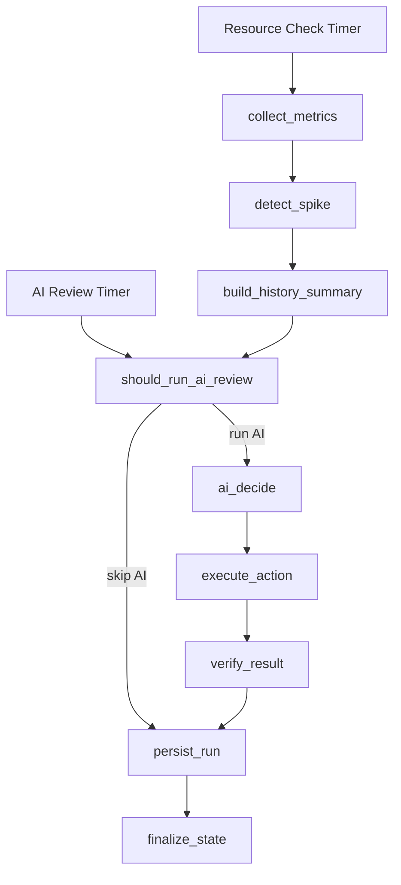

# CSS Elasticity AIOps Agent

AI-assisted elasticity control for **Huawei Cloud CSS**, with policy checks, safety guards, and optional shard-aware diagnostics.

`css-elasticity-aiops-agent` is a production-oriented controller that combines:

- Huawei Cloud CES / Cloud Eye metrics
- rule-based validation and cooldown logic
- an OpenAI-compatible model for elasticity recommendations
- optional OpenSearch diagnostics for safer scale-in decisions
- CSS execution and verification logic
- SQLite-based run history and auditability

This project is for operators and platform teams who want **AI-assisted but policy-constrained** scaling, not a chatbot and not a generic agent playground.

## Why This Exists

CSS elasticity is often handled with a mix of static thresholds, manual reviews, and ad hoc operator judgment. That works until clusters become larger, traffic becomes more variable, and scaling actions start carrying higher operational risk.

This project aims to make elasticity decisions:

- faster
- more consistent
- easier to audit
- safer to automate

The key principle is simple:

**AI can recommend, but policy decides whether a change is allowed.**

## What It Does

- Collects CSS metrics from CES / Cloud Eye
- Detects spikes and sustained pressure
- Runs scheduled AI elasticity reviews
- Triggers immediate AI review on spikes
- Supports `hold`, `scale_out`, `scale_in`, and `change_flavor`
- Applies min/max node rules, cooldowns, and safety validation before mutation
- Supports recommendation-only, approval-required, and auto-execute modes
- Verifies scaling results after execution
- Persists metrics, decisions, actions, and workflow state in SQLite

## Architecture



## Repository Layout

```text
app/
  main.py                    CLI entrypoint
  graph.py                   LangGraph workflow
  scheduler.py               Single-run and loop scheduler
  ai_client.py               OpenAI-compatible AI client
  config.py                  Environment-based configuration
  metrics/                   Real and mock metrics providers
  executors/                 Real and mock CSS action executors
  diagnostics/               Optional OpenSearch diagnostics
  nodes/                     Workflow nodes
  repositories/              SQLite persistence
  services/                  Policy, cooldown, validation, spike analysis
tests/                       Unit tests
```

## Quick Start

Create a virtual environment:

```bash
python -m venv .venv
source .venv/bin/activate
```

Install dependencies:

```bash
pip install -r requirements.txt
pip install pytest
```

Copy the sample environment file:

```bash
cp .env.example .env
```

Run tests:

```bash
python -m pytest -q
```

Run a single cycle:

```bash
python -m app.main --once
```

Run continuously:

```bash
python -m app.main --loop
```

## Recommended First Deployment

Start in non-mutating mode:

```env
AGENT_RUN_MODE=recommend-only
CSS_MUTATION_ENABLED=false
```

This allows you to validate:

- metric collection
- spike detection
- AI recommendation quality
- policy behavior
- persistence and audit trail

without allowing real CSS changes.

## Configuration

The project is configured entirely through environment variables. Start from `.env.example`.

### AI Provider

Any OpenAI-compatible API can be used, including Huawei Cloud ModelArts MaaS when exposed with an OpenAI-compatible interface.

```env
OPENAI_BASE_URL=https://your-openai-compatible-endpoint/v1
OPENAI_API_KEY=<api-key>
OPENAI_MODEL=<model-name>
```

### Huawei Cloud Runtime

Set Huawei Cloud credentials and endpoints explicitly:

```env
HUAWEICLOUD_SDK_AK=replace-me
HUAWEICLOUD_SDK_SK=replace-me
HUAWEICLOUD_REGION=replace-me
HUAWEICLOUD_PROJECT_ID=replace-me
HUAWEICLOUD_IAM_ENDPOINT=https://iam.myhuaweicloud.com
HUAWEICLOUD_CSS_ENDPOINT=
HUAWEICLOUD_CES_ENDPOINT=
CLUSTER_ID=replace-me
CLUSTER_NAME=replace-me
```

### Providers

Use real integrations for production-style runs:

```env
METRICS_PROVIDER=css
EXECUTOR_PROVIDER=css
```

### Mutation Safety

Real mutation requires both:

```env
AGENT_RUN_MODE=auto-execute
CSS_MUTATION_ENABLED=true
```

If either one is missing, the agent will not mutate CSS.

### Optional OpenSearch Diagnostics

Enable OpenSearch diagnostics for shard-aware capacity governance:

```env
DIAGNOSTICS_PROVIDER=opensearch
OPENSEARCH_ENDPOINT=https://replace-with-endpoint:9200
OPENSEARCH_USERNAME=replace-with-username
OPENSEARCH_PASSWORD=<password>
OPENSEARCH_VERIFY_TLS=false
```

When enabled, the agent can block risky data-node scale-in decisions based on shard sizing, skew, and storage pressure.

## Operating Modes

- `observe-only`: collect and persist signals without AI execution
- `recommend-only`: call AI, validate decisions, but never mutate CSS
- `approval-required`: require explicit approval data before mutation
- `auto-execute`: allow real CSS mutation when policy checks pass

For most production rollouts, `recommend-only` is the correct starting point.

## Supported Actions

- `hold`
- `scale_out`
- `scale_in`
- `change_flavor`

The executor supports these CSS node types:

- `ess` for data nodes
- `ess-client` for client nodes
- `ess-master` for dedicated master nodes

## Persistence and Auditability

The agent stores:

- collected metrics
- AI decisions
- executed or skipped actions
- verification results
- workflow state

Default local paths:

```env
SQLITE_DB_PATH=data/agent.sqlite3
LOG_DIR=data/logs
```

These paths are excluded from Git tracking.

## Security Notes

- Do not commit real Huawei Cloud credentials
- Do not commit model API keys
- Keep `.env` local only
- Start in non-mutating mode before enabling automation
- Review node limits, cooldowns, and policy settings before production use

## Who This Is For

This repository is useful if you want to:

- study a practical LangGraph-based AIOps controller
- adapt AI-assisted scaling for Huawei Cloud CSS
- test safe recommendation flows before enabling mutation
- extend the policy engine for enterprise CSS clusters

## Roadmap

- container packaging
- deployment examples for ECS / CCE
- richer approval workflows
- more replay and audit tooling
- more diagnostics and policy integrations

## Contributing

See [CONTRIBUTING.md](./CONTRIBUTING.md).

## License

This project is licensed under the [MIT License](./LICENSE).
