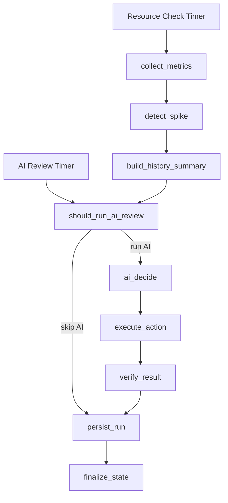

# CSS Elasticity AIOps Agent

`css-elasticity-aiops-agent` is a production-oriented AIOps controller for Huawei Cloud CSS. It monitors CSS metrics through Cloud Eye, detects sustained pressure or sudden spikes, asks an OpenAI-compatible model for an elasticity decision, validates the decision with application-side safety rules, executes CSS scaling, verifies the result, and stores the full operational history in SQLite.

This is not a chatbot and not a multi-agent system. It uses one LangGraph workflow with shared typed state.

## What It Does

- Collects CSS metrics from Cloud Eye.
- Detects spikes in CPU, latency, QPS, search queue, and rejected searches.
- Runs periodic AI elasticity reviews.
- Triggers immediate AI review when a spike is detected.
- Supports `scale_out`, `scale_in`, `change_flavor`, and `hold` decisions.
- Enforces min/max node boundaries and cooldown before executing any scaling action.
- Records AI recommendations and only executes CSS mutations when the run mode and mutation guard explicitly allow it.
- Executes real CSS node scale-out, scale-in, and node-type flavor changes through Huawei Cloud CSS SDK.
- Verifies submitted scaling actions by polling CSS node state.
- Treats CSS scaling as a long-running operation, so normal metric checks can continue while provisioning is pending.
- Persists metrics, AI decisions, actions, verification results, state, and scheduler runs.

## Architecture



## Project Layout

```text
app/
  main.py                  CLI entrypoint
  config.py                Environment-based runtime configuration
  graph.py                 LangGraph workflow definition
  scheduler.py             --once and --loop scheduler
  ai_client.py             OpenAI-compatible decision client
  metrics/css_provider.py  Real Cloud Eye metrics provider
  executors/css_executor.py Real CSS scaling executor
  nodes/                   LangGraph node implementations
  repositories/            SQLite persistence repositories
  services/                Spike detection, cooldown, validation, policy, history summary
tests/                     Unit tests for parser, spike detection, persistence, rules
```

## Requirements

- Python 3.11+
- Huawei Cloud CSS cluster
- Huawei Cloud AK/SK with permission to read CSS/CES and execute CSS scaling
- OpenAI-compatible model endpoint
- Network access to Huawei Cloud CSS, CES, IAM, and the model endpoint

The current environment was validated with Python from `pyenv`, but any Python 3.11+ environment should work.

## Installation

Create and activate a virtual environment:

```bash
python -m venv .venv
source .venv/bin/activate
```

Install dependencies:

```bash
pip install -r requirements.txt
```

Run tests:

```bash
python -m pytest -q
```

## Configuration

Copy the sample environment file:

```bash
cp .env.example .env
```

Edit `.env` with your own values. Do not commit `.env` and do not commit real secrets.

### AI Provider

For Huawei Cloud ModelArts MaaS OpenAI-compatible API:

```env
OPENAI_BASE_URL=https://replace-with-openai-compatible-endpoint/v1
OPENAI_API_KEY=replace-with-your-maas-api-key
OPENAI_MODEL=glm-5.1
```

Any OpenAI-compatible API can be used if it supports `chat.completions.create`.

### CSS/CES Provider

Use real CSS/CES providers:

```env
METRICS_PROVIDER=css
EXECUTOR_PROVIDER=css
```

### OpenSearch Capacity Diagnostics

For shard-aware capacity governance, enable OpenSearch diagnostics. Credentials are read from environment variables and must not be committed:

```env
DIAGNOSTICS_PROVIDER=opensearch
OPENSEARCH_ENDPOINT=https://replace-with-client-or-lb-endpoint:9200
OPENSEARCH_USERNAME=replace-with-username
OPENSEARCH_PASSWORD=replace-with-password
OPENSEARCH_VERIFY_TLS=false
```

The diagnostics provider collects `_cluster/health`, `_cat/nodes`, `_cat/allocation`, `_cat/indices`, and `_cat/shards`. The capacity analyzer derives:

- primary shard size range
- shard count and shard skew by node
- storage skew by node
- shards per GiB heap
- recommendations for rollover, shard reduction, allocation rebalance, or data-node scale-in blocking

Best-practice defaults:

```env
SHARD_SEARCH_MIN_GB=10
SHARD_SEARCH_MAX_GB=30
SHARD_GENERAL_MAX_GB=50
MAX_SHARDS_PER_GB_HEAP=25
MAX_STORAGE_SKEW_RATIO=1.5
MAX_SHARD_SKEW_RATIO=1.5
```

If capacity analysis detects oversized shards, oversharding, high storage skew, or high shard skew, data-node scale-in is blocked even when AI recommends it.

Set Huawei Cloud runtime values:

```env
HUAWEICLOUD_SDK_AK=replace-with-your-ak
HUAWEICLOUD_SDK_SK=replace-with-your-sk
HUAWEICLOUD_REGION=replace-with-region-id
HUAWEICLOUD_PROJECT_ID=replace-with-project-id
HUAWEICLOUD_IAM_ENDPOINT=https://iam.myhuaweicloud.com
HUAWEICLOUD_CSS_ENDPOINT=https://css.<region-id>.myhuaweicloud.com
HUAWEICLOUD_CES_ENDPOINT=https://ces.<region-id>.myhuaweicloud.com
CLUSTER_ID=replace-with-css-cluster-id
CLUSTER_NAME=replace-with-css-cluster-name
```

For example, if the region is `example-region-1`, the endpoints usually follow this pattern:

```env
HUAWEICLOUD_CSS_ENDPOINT=https://css.example-region-1.myhuaweicloud.com
HUAWEICLOUD_CES_ENDPOINT=https://ces.example-region-1.myhuaweicloud.com
```

### Node Types and Limits

The production CSS executor builds topology for all supported node types and lets the AI choose the target:

- `ess`: data nodes
- `ess-client`: client nodes
- `ess-master`: dedicated master nodes

Default limits are used when `CSS_NODE_LIMITS_JSON` is empty:

```env
CSS_DEFAULT_DATA_MIN=1
CSS_DEFAULT_DATA_MAX=200
CSS_DEFAULT_CLIENT_MIN=0
CSS_DEFAULT_CLIENT_MAX=64
CSS_DEFAULT_MASTER_ALLOWED_COUNTS=0,3,5,7,9
```

Override them with explicit JSON when needed:

```env
CSS_NODE_LIMITS_JSON={"ess":{"min":2,"max":6},"ess-client":{"min":1,"max":4},"ess-master":{"allowed_counts":[0,3]}}
```

`CSS_NODE_TYPE` remains only as a backward-compatible default for legacy single-node checks. AI decisions use the explicit `node_type` returned by the model.

Data nodes are the primary elasticity target. AI may recommend multi-node Data scale-out or scale-in based on business growth/decline, CPU growth rate, QPS growth rate, expected operation duration, historical actions, node limits, and capacity diagnostics. Keep `CSS_DEFAULT_DATA_MIN` or `CSS_NODE_LIMITS_JSON.ess.min` conservative enough for shard replicas, disk headroom, and failure tolerance.

CSS itself may still enforce provider-side shrink limits for Data nodes. In real tests, CSS rejected shrinking half of the current Data nodes in one request. The agent handles this by splitting a larger AI target into provider-safe batches, such as `6 -> 4 -> 3`, while preserving the original target in history.

### Flavor Changes

The agent can let AI choose a node-type flavor change when enabled:

```env
CSS_ALLOW_FLAVOR_CHANGE=true
```

The executor queries `show_resize_flavors` and falls back to `list_flavors` so the AI can see available Data, Client, and Master specs. Flavor changes use CSS `update_flavor_by_type`.

### Mutation Guard

Commercial-safe defaults are recommendation-only and mutation-disabled:

```env
AGENT_RUN_MODE=recommend-only
CSS_MUTATION_ENABLED=false
```

Supported run modes:

- `observe-only`: collect and persist signals; recommended for initial deployment.
- `recommend-only`: collect metrics, call AI, validate the recommendation, and record skipped execution.
- `approval-required`: require an explicit approved action payload in state before CSS mutation.
- `auto-execute`: allow CSS mutation when `CSS_MUTATION_ENABLED=true` and validation passes.

To allow automatic CSS mutations, both settings must be explicit:

```env
AGENT_RUN_MODE=auto-execute
CSS_MUTATION_ENABLED=true
```

When mutation is not allowed, the workflow still collects metrics, topology, flavors, and AI decisions, but any scale or flavor-change action is recorded as skipped with a policy status.

### Large-Cluster Enterprise Policy

For customers with dozens of CSS nodes, enable the large-cluster policy profile and keep high-risk actions approval-gated:

```env
ENTERPRISE_POLICY_PROFILE=large-cluster
ELASTICITY_STRATEGY_PROFILE=aggressive
AUTO_EXECUTE_NODE_TYPES=ess
APPROVAL_REQUIRED_ACTIONS=ess-client:scale_out,ess-client:scale_in,ess-master:scale_out,ess-master:scale_in,change_flavor
MAINTENANCE_WINDOW_UTC=02:00-05:00
```

`ENTERPRISE_POLICY_PROFILE` controls enterprise guardrails. `ELASTICITY_STRATEGY_PROFILE` controls how fast the agent reacts. The default is `aggressive`, based on real testing where CSS Data scale-out took minutes and one-by-one scaling would lag behind bursty traffic.

Supported elasticity strategy profiles:

- `aggressive`: default. Low-load reclaim window is 10 minutes, Data scale-out/in cooldowns are 10 minutes, no extra scale-out observation window, higher daily action budget, and lower burst thresholds.
- `balanced`: medium mode. Low-load reclaim window is 30 minutes, Data cooldowns are 20 minutes, 15-minute scale-out observation window, moderate burst thresholds.
- `conservative`: reserved mode. Low-load reclaim window is 120 minutes, longer Data cooldowns, 60-minute scale-out observation window, stricter burst thresholds, and lower daily action budget.

Specific env vars still override the profile. For example, `ELASTICITY_STRATEGY_PROFILE=aggressive` with `SCALE_IN_LOW_LOAD_MINUTES=60` keeps aggressive burst behavior but waits 60 minutes before scale-in.

The policy engine records a change plan for every non-hold recommendation:

- risk level: `low`, `medium`, `high`, or `blocked`
- pre-checks and post-checks
- maintenance-window requirement
- approval requirement
- rollback hint

The large-cluster profile also consumes OpenSearch capacity diagnostics when enabled. It blocks data-node scale-in if shard sizing or allocation health would make shrink unsafe:

- primary shard larger than `SHARD_GENERAL_MAX_GB`
- shards per GiB heap above `MAX_SHARDS_PER_GB_HEAP`
- storage skew above `MAX_STORAGE_SKEW_RATIO`
- shard-count skew above `MAX_SHARD_SKEW_RATIO`

Recommended production posture for large clusters:

- Data node scale-out and scale-in are the primary automated elasticity path when capacity diagnostics are safe.
- Client node changes are stability operations and should remain approval-required by default.
- Master node changes and flavor changes should remain approval-required.
- Client node scale-in still requires sustained low load and safe traffic drain if explicitly enabled.
- Pending CSS operations block new AI actions until verification completes.

### Data Node Scale-In Guard

Data node scale-in is enabled by default because Data nodes are the main elasticity layer:

```env
CSS_DATA_SCALE_IN_ALLOWED=true
```

Disable it only when change control requires manual approval for any Data capacity reduction:

```env
CSS_DATA_SCALE_IN_ALLOWED=false
```

Even when enabled, Data scale-in is blocked if OpenSearch capacity diagnostics report shard-size, oversharding, storage-skew, or shard-skew risk. The policy layer also requires the configured low-load window, no pending CSS operation, and node limits to be respected.

### Traffic Entry Mode and Client Scale-In

Client nodes do not store shards, but they may be application entry points. If applications connect directly to Client node IPs and a Client node is removed, those connections fail. Configure the traffic entry mode explicitly:

```env
CSS_TRAFFIC_ENTRY_MODE=unknown
CSS_CLIENT_SCALE_IN_ALLOWED=false
```

Supported modes:

- `unknown`: default; Client node scale-in is blocked.
- `direct_ip`: applications connect directly to node IPs; Client node scale-in is blocked.
- `load_balancer`: traffic is behind a load balancer or equivalent drain mechanism; Client node scale-in can be allowed if `CSS_CLIENT_SCALE_IN_ALLOWED=true`.

The validator requires both:

```env
CSS_TRAFFIC_ENTRY_MODE=load_balancer
CSS_CLIENT_SCALE_IN_ALLOWED=true
```

Without both, any `ess-client` scale-in decision is converted to `hold`.

### Scheduling

```env
RESOURCE_CHECK_INTERVAL_SECONDS=300
AI_CHECK_INTERVAL_SECONDS=1800
```

Resource checks run every 5 minutes by default. AI reviews run every 30 minutes by default. A spike detected during a resource check immediately triggers AI review.

For active elasticity tests or faster Data node scale-in observation, a 1-minute schedule is practical:

```env
RESOURCE_CHECK_INTERVAL_SECONDS=60
AI_CHECK_INTERVAL_SECONDS=60
FAST_SCALE_IN_REVIEW_ENABLED=true
```

`RESOURCE_CHECK_INTERVAL_SECONDS` controls metrics collection and spike detection. `AI_CHECK_INTERVAL_SECONDS` controls normal non-spike reviews, which matters for scale-in because scale-in normally follows sustained low load instead of a spike.

Do not make the interval shorter than the metric source can reliably refresh. A 60-second interval is usually a good lower bound for test runs; production large clusters should balance reaction speed against Cloud Eye delay, AI cost, and operational noise.

### AI-Driven Delta Sizing

The AI can return `delta > 1`. The application does not hard-code a fixed scale-out or scale-in quantity. Instead, the prompt receives recent business growth or decline, expected CSS operation duration, current topology, node limits, cooldown state, pending operation state, and recent scaling history. The AI is responsible for choosing the scale quantity.

```env
CSS_CLIENT_SCALE_OUT_MAX_DELTA=0
CSS_CLIENT_SCALE_IN_MAX_DELTA=0
CSS_DATA_SCALE_OUT_MIN_DELTA=1
CSS_DATA_SCALE_OUT_MAX_DELTA=200
CSS_DATA_SCALE_IN_MAX_DELTA=0
CSS_DATA_SCALE_OUT_TARGET_CPU=65
CSS_DATA_SCALE_OUT_PROJECTION_MINUTES=30
CSS_DATA_SCALE_OUT_BURST_QPS_MULTIPLIER=8
CSS_DATA_SCALE_OUT_BURST_CPU_MIN=15
CSS_DATA_SCALE_OUT_BURST_NODE_FRACTION=1.0
```

`CSS_DATA_SCALE_OUT_MIN_DELTA` and `CSS_DATA_SCALE_OUT_MAX_DELTA` define the allowed single-action Data scale-out range. The default allows AI to recommend adding from 1 to 200 Data nodes in one action, still bounded by `CSS_NODE_LIMITS_JSON.ess.max` or `CSS_DEFAULT_DATA_MAX`. Other `*_MAX_DELTA=0` values mean no per-action cap beyond node limits and product safety rules.

The workflow also computes a Data scale-out advisory delta before calling AI. The advisory uses recent CPU growth rate, QPS growth rate, current Data node count, target CPU headroom, expected CSS count-scaling duration, remaining node headroom, and an optional burst floor. The burst floor is activated when QPS increases by a configured multiple and Data CPU is already above a configured minimum. For short metric windows, the advisor uses a shorter effective projection window to avoid overreacting to one brief spike. This advisory is passed into the prompt as sizing context. AI still makes the final decision and may hold, choose a smaller delta, or choose a larger delta within limits if the evidence supports it.

The workflow also computes a Data scale-in advisory delta. It separates the total capacity to reclaim from the next safe CSS batch:

- `target_delta`: total temporary Data capacity that should be reclaimed based on recent net Data scale-out.
- `provider_safe_delta`: maximum Data scale-in batch currently expected to pass CSS provider-side limits.
- `recommended_delta`: next action size supplied to AI. This is usually the smaller of `target_delta`, `provider_safe_delta`, configured max delta, and remaining removable nodes.

For example, after a burst-driven `3 -> 6` Data scale-out, the advisory may target reclaiming 3 nodes. If CSS does not allow `6 -> 3` in one request, the next recommended batch is `2`, producing `6 -> 4`. After that operation stabilizes and cooldown clears, the next cycle can recommend `1`, producing `4 -> 3`.

To allow a single action to add or remove many Data nodes, configure enough node-type headroom:

```env
CSS_NODE_LIMITS_JSON={"ess":{"min":40,"max":200},"ess-client":{"min":3,"max":20},"ess-master":{"allowed_counts":[3,5,7]}}
```

To prevent a single AI decision from adding more than 10 Data nodes:

```env
CSS_DATA_SCALE_OUT_MAX_DELTA=10
```

To force every Data scale-out action to add at least 5 nodes when AI chooses `scale_out`:

```env
CSS_DATA_SCALE_OUT_MIN_DELTA=5
```

Use the same pattern for controlled multi-node scale-in caps:

```env
CSS_DATA_SCALE_IN_MAX_DELTA=10
```

Data-node scale-in is agile, but not blind. Even if AI returns `delta > 1`, the validator still respects min nodes, per-action max delta caps, cooldown, and pending-operation gates. The policy layer blocks data-node scale-in when OpenSearch capacity diagnostics indicate shard, disk, or skew risk.

If AI asks for a Data scale-in batch that CSS rejects because it exceeds provider-side shrink limits, the executor retries once with a provider-safe batch and records both values:

- `requested_delta`: the AI-requested target for this action.
- `applied_delta`: the actual submitted CSS batch.

This keeps execution efficient without hiding the provider constraint from audit history.

Recommended fast Data scale-in test posture:

```env
RESOURCE_CHECK_INTERVAL_SECONDS=60
AI_CHECK_INTERVAL_SECONDS=60
ELASTICITY_STRATEGY_PROFILE=aggressive
SCALE_IN_LOW_LOAD_MINUTES=10
CSS_DATA_SCALE_IN_ALLOWED=true
CSS_DATA_SCALE_IN_MAX_DELTA=10
CSS_DATA_SCALE_IN_COOLDOWN_MINUTES=10
```

Use `ELASTICITY_STRATEGY_PROFILE=balanced` or `ELASTICITY_STRATEGY_PROFILE=conservative` when traffic is less predictable, shard density is high, or change control requires slower capacity reduction.

### Spike Thresholds

```env
CPU_SPIKE_THRESHOLD=80
LATENCY_SPIKE_THRESHOLD=500
REJECTED_SPIKE_THRESHOLD=1
QPS_SPIKE_THRESHOLD=2.0
```

`QPS_SPIKE_THRESHOLD` is a multiplier against the previous snapshot. For example, `2.0` means QPS doubled.

### Verification

CSS scaling is asynchronous. After submitting a scale action, the executor polls CSS until the target node count is reached and target nodes are stable.

```env
CSS_VERIFY_TIMEOUT_SECONDS=900
CSS_VERIFY_POLL_INTERVAL_SECONDS=30
CSS_BLOCKING_VERIFICATION=false
```

The default workflow behavior is non-blocking. A scale action is submitted, one immediate verification probe is recorded, and if CSS is still provisioning, the operation is persisted as pending. Later scheduler cycles continue collecting metrics and checking the pending operation. AI reviews are skipped while a pending scaling operation exists, preventing duplicate scale-out or scale-in requests during the long CSS provisioning window.

Use `CSS_BLOCKING_VERIFICATION=true` only for manual validation scripts where you explicitly want the process to wait until CSS reaches the target state or the timeout expires.

## Safe Smoke Test

Before allowing real scaling, run a safe smoke test with CSS writes disabled:

```bash
AGENT_RUN_MODE=recommend-only CSS_MUTATION_ENABLED=false python -m app.main --once
```

This validates:

- CSS cluster access
- Cloud Eye metric collection
- Model API access
- AI response parsing
- persistence
- action validation
- mutation guard behavior

## Run One Cycle

Run one workflow cycle:

```bash
python -m app.main --once
```

This performs:

1. Read current CSS node count.
2. Collect Cloud Eye metrics.
3. Detect spikes.
4. Build recent history summary.
5. Decide whether AI review should run.
6. Call the OpenAI-compatible model if needed.
7. Validate and clamp the AI decision.
8. Execute CSS scaling if allowed.
9. Verify the result once.
10. Persist the full run.

The command prints the final workflow state as JSON.

If scaling is still pending, the final state includes:

- `pending_operation=true`
- `pending_operation_reason`
- `verification_result.status=pending`
- `verification_result.observed_instances`

The next scheduler cycle will poll the same pending action again. This keeps monitoring active during long CSS provisioning instead of blocking the scheduler for several minutes.

## Run Continuously

Run the in-process scheduler:

```bash
python -m app.main --loop
```

Stop with `Ctrl+C` or `SIGTERM`.

The scheduler is intentionally lightweight. For production daemonization, run it under systemd, supervisord, or a similar process manager.

## AI Decision Format

The model is instructed to return strict JSON:

```json
{
  "decision": "scale_out",
  "node_type": "ess-client",
  "delta": 1,
  "target_flavor_id": null,
  "reason": "CPU and search pressure are sustained above threshold",
  "cooldown_minutes": 30,
  "expected_duration_minutes": 30
}
```

Allowed decisions:

- `scale_out`
- `scale_in`
- `change_flavor`
- `hold`

Safety behavior:

- malformed output falls back to `hold`
- invalid fields fall back to `hold`
- scale and flavor decisions require a valid `node_type`
- `change_flavor` requires `target_flavor_id`
- negative deltas are rejected
- `hold` always forces `delta=0`
- scale actions are clamped by per-node-type limits and CSS constraints
- cooldown prevents repeated scaling

The parser also tolerates fenced JSON such as:

```text
```json
{"decision":"hold","node_type":null,"delta":0,"target_flavor_id":null,"reason":"stable","cooldown_minutes":30,"expected_duration_minutes":30}
```
```

This is useful for models that wrap JSON in Markdown despite the prompt.

## Persistence

SQLite is used by default:

```env
SQLITE_DB_PATH=data/agent.sqlite3
```

Persisted tables:

- `metrics_snapshots`
- `ai_decisions`
- `actions`
- `action_events`
- `verifications`
- `agent_state`
- `scheduler_runs`

The database is local operational history. Treat it as sensitive because it may contain cluster IDs, metric values, and AI decisions.

## Logs

Configure log output:

```env
LOG_DIR=data/logs
LOG_LEVEL=INFO
JSON_LOGS=false
```

Logs are written to console and rotating files. Use `JSON_LOGS=true` if structured JSON logs are preferred.

## Real Scaling Checklist

Before enabling real scale actions:

- Confirm `CLUSTER_ID`, `HUAWEICLOUD_REGION`, and `HUAWEICLOUD_PROJECT_ID` are correct.
- Confirm AK/SK permissions for CSS detail, CSS scaling, and CES metric reads.
- Confirm per-node-type limits are safe.
- Run the safe smoke test with `AGENT_RUN_MODE=recommend-only` and `CSS_MUTATION_ENABLED=false`.
- Run `--once` with production boundaries and inspect the printed state.
- Enable `AGENT_RUN_MODE=approval-required` first if customer change control requires manual approval.
- Enable `AGENT_RUN_MODE=auto-execute` and `CSS_MUTATION_ENABLED=true` only after validating the policy behavior.
- Only then run `--loop`.

## Common Issues

### Current node count is 0

Check `topology.node_types`. If the cluster has only `ess` nodes, the `ess-client` count will be `0`. That is expected and not a permission issue.

### First Client node scale-out fails with CSS.5042

The role-based CSS scale-out API can scale existing special node roles such as `ess-client`, but it may fail when the cluster has zero Client nodes because there is no source Client instance to clone. In that case CSS may return:

```text
CSS.5042 : The source instance does not exist.
```

The agent supports CSS `add_independent_node` for the first Client or Master node when `CSS_ALLOW_ADD_INDEPENDENT_NODES=true` and a valid flavor ID is available. If this still fails, check CSS console/CTS for region-specific constraints.

### Data node scale-in is blocked

Data node scale-in is allowed by default, but it can still be blocked by safety gates. Check:

- `CSS_DATA_SCALE_IN_ALLOWED=true`
- `CSS_NODE_LIMITS_JSON.ess.min` leaves enough remaining Data nodes
- OpenSearch capacity analysis does not block scale-in
- low load has been sustained for `SCALE_IN_LOW_LOAD_MINUTES`
- no pending CSS operation exists
- daily scaling action limit has not been reached

The controller does not use a hard-coded Data shrink target, but it does account for provider-side CSS shrink limits when sizing the next Data scale-in batch. If CSS rejects a shrink request because the requested batch is too large, the executor retries once with a smaller provider-safe batch. Inspect `requested_delta`, `applied_delta`, CSS task errors, node status, and shard relocation state to understand what happened.

### Shrink impact by node type

Data node scale-in usually triggers shard relocation and data migration. It can consume disk I/O, network, CPU, and JVM heap, and can increase query/write latency during migration. It is still the primary elasticity path, but run it only after sustained low load, green health, enough disk headroom, no pending operations, safe capacity analysis, and a safe remaining node count.

Client node scale-in does not move data shards, but it can remove an application endpoint. Without a load balancer or connection-drain mechanism, applications that connect directly to the removed Client node IP can see connection failures. The agent blocks automatic Client scale-in unless traffic entry mode is `load_balancer` and Client scale-in is explicitly enabled.

Master node scale-in does not move business data shards, but it affects cluster coordination and master election. Only valid odd-count reductions such as `7 -> 5` or `5 -> 3` should be considered. Never automatically shrink dedicated masters below 3 when dedicated masters are in use.

### AI returns Markdown instead of pure JSON

The parser handles fenced JSON and embedded JSON. If the output still cannot be parsed, the system falls back to `hold`.

### CES metrics are partially missing

Some CSS metric names may not exist in every region or cluster version. The provider logs the failed metric and returns `0.0` for that metric so the workflow can continue.

### Scaling request succeeds but verification fails

CSS scaling is asynchronous. In normal workflow mode the agent does not block for the full timeout; it persists the operation as pending and re-checks it in later cycles. If you are running a manual blocking validation, increase:

```env
CSS_VERIFY_TIMEOUT_SECONDS=1800
CSS_VERIFY_POLL_INTERVAL_SECONDS=30
```

Also check the CSS console for cluster tasks and node status.

## Development

Run tests:

```bash
python -m pytest -q
```

Compile-check Python files:

```bash
python -m compileall app tests
```

Run with mock providers for local development:

```bash
METRICS_PROVIDER=mock EXECUTOR_PROVIDER=mock python -m app.main --once
```

Mock mode is only for local development and unit testing. Production validation should use `METRICS_PROVIDER=css` and `EXECUTOR_PROVIDER=css`.
